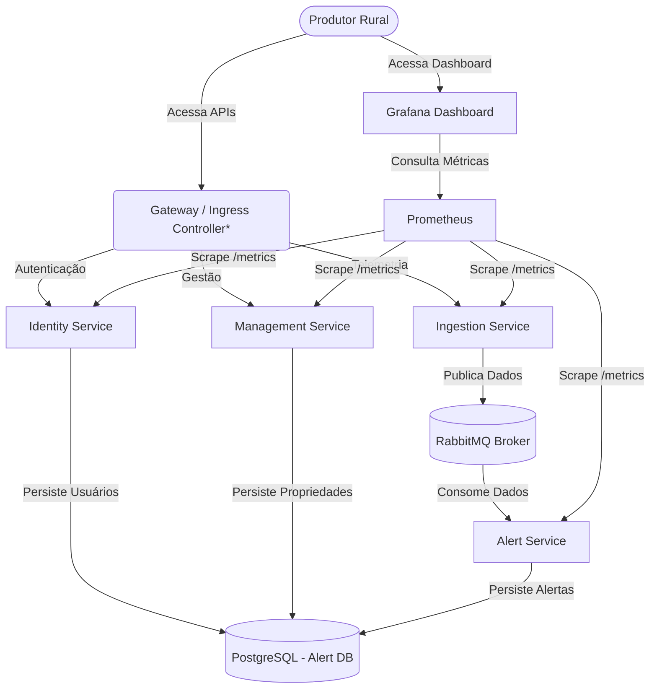

# Arquitetura da Solução - AgroSolutions MVP

## 1. Visão Geral da Arquitetura
A plataforma AgroSolutions foi desenhada baseada no padrão de **Microsserviços**. Cada domínio possui seu próprio serviço, banco de dados (ou schema isolado) e responsabilidades delimitadas para aumentar a coesão e reduzir o acoplamento. 

### Diagrama de Contexto & Container (C4 Model)

## 2. Componentes e Responsabilidades

* **Identity Service (.NET 8):** Responsável por registro de produtores e emissão de tokens JWT.
* **Management Service (.NET 8):** Responsável pelo "Core Domain" da fazenda (gestão de propriedades rurais e seus talhões/áreas de plantio). Acesso seguro via JWT.
* **Ingestion Service (.NET 8):** Ponto de entrada (High Throughput) para telemetria de sensores de sensores de IoT. Não persiste dados, apenas enfileira as requisições no RabbitMQ para processamento em background.
* **Alert Service (.NET 8 Worker):** Consumidor do RabbitMQ. Avalia regras de negócio sobre as métricas (Ex: Umidade < 30%). Se acionado, gera alertas persistentes no banco.
* **Message Broker (RabbitMQ):** Desacopla a Ingestão da Análise. Garante resiliência: se o Alert Service cair, as medições ficam retidas.
* **PostgreSQL:** Banco de dados relacional (dividido logicamente em diferentes schemas/bases por serviço).
* **Observabilidade:**
  * **Prometheus:** Coleta as métricas HTTP e latência dos serviços .NET consumindo o endpoint `/metrics` exposto pela lib `prometheus-net`.
  * **Grafana:** Exibe as métricas de RPS (Requests per Second) do sistema em um dashboard pré-provisionado.

## 3. Requisitos Não Funcionais Atendidos

* **Escalabilidade:** Como a ingestão de IoT gera muito fluxo, ela foi separada utilizando RabbitMQ. O `Ingestion Service` pode escalar horizontalmente para receber requisições de milhares de sensores, enquanto o `Alert Service` processa o consumo conforme capacidade, protegendo o banco contra sobrecarga de writes e Deadlocks.
* **Portabilidade:** Todos os componentes foram containerizados (Docker) com suporte nativo de orquestração via manifestos Kubernetes (Deployments/Services), podendo rodar no Minikube/Kind, ou na AWS EKS/Azure AKS.
* **Estabilidade e Testabilidade:** Criada esteira de CI/CD (GitHub Actions) validando o build das imagens Docker e os testes unitários da lógica de serviço Core na compilação.
